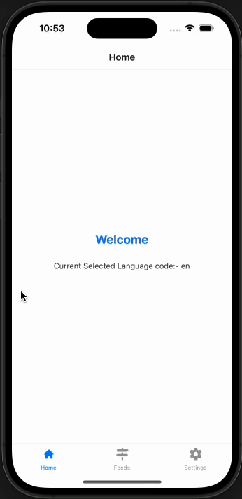

# RNProBoilerCore - React Native Project Boilerplate

RNProBoilerCore is a React Native project boilerplate that provides a solid foundation for building scalable and maintainable mobile apps. It incorporates best practices for project structure, theming, localization, component creation, custom hooks, Redux Toolkit, and navigation.

## Features

- **Project Structure**: The project structure follows a modular pattern, making it easy to organize and scale your application. The key directories are:
  - `src`: Main source code.
  - `src/components`: Reusable UI components.
  - `src/config`: Application configs includes Localization, Store, Theme setup.
  - `src/navigation`: Navigation setup.
  - `src/hooks`: Custom hooks.
  - `src/hooks`: Application Constants.
  - `src/core-ui`: Core app things.
  - `src/fixtures`: All temporary/fake data
  - `src/helpers`: Helper functions
  - `src/modules`: App Modules includes all the modules
  - `src/services`: Application services
  
- **Theming**: The project includes a theming system that allows you to easily customize the visual appearance of your app.

- **Localization**: Built-in support for localization using the popular `react-native-localization` library. Easily translate your app into multiple languages.

- **Reusable Components**: A collection of reusable UI components to help you build your app faster.

- **Redux Toolkit**: State management is set up using Redux Toolkit, making it efficient and straightforward to manage your app's state.

- **Navigation**: The project includes React Navigation setup with navigators and routing configured.


### Prerequisites

- Install `eslint` and `prettier` plugins into your IDE
- Ensure your machine has the [React Native dependencies installed](https://facebook.github.io/react-native/docs/getting-started)


### Getting Started

```bash
git clone https://github.com/sonalmaniya/RNProBoilerCore.git
  ```

```bash
# Install dependencies
yarn install && npx pod-install
```

#### iOS

```bash
# Start in the iOS Simulator
yarn ios
```

#### Android

```bash
# Start in the Android Simulator
yarn android
```

### App View

